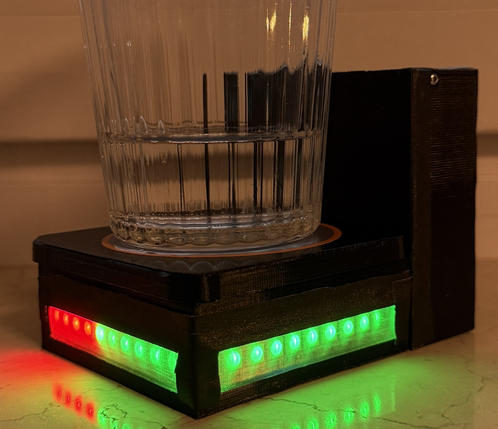
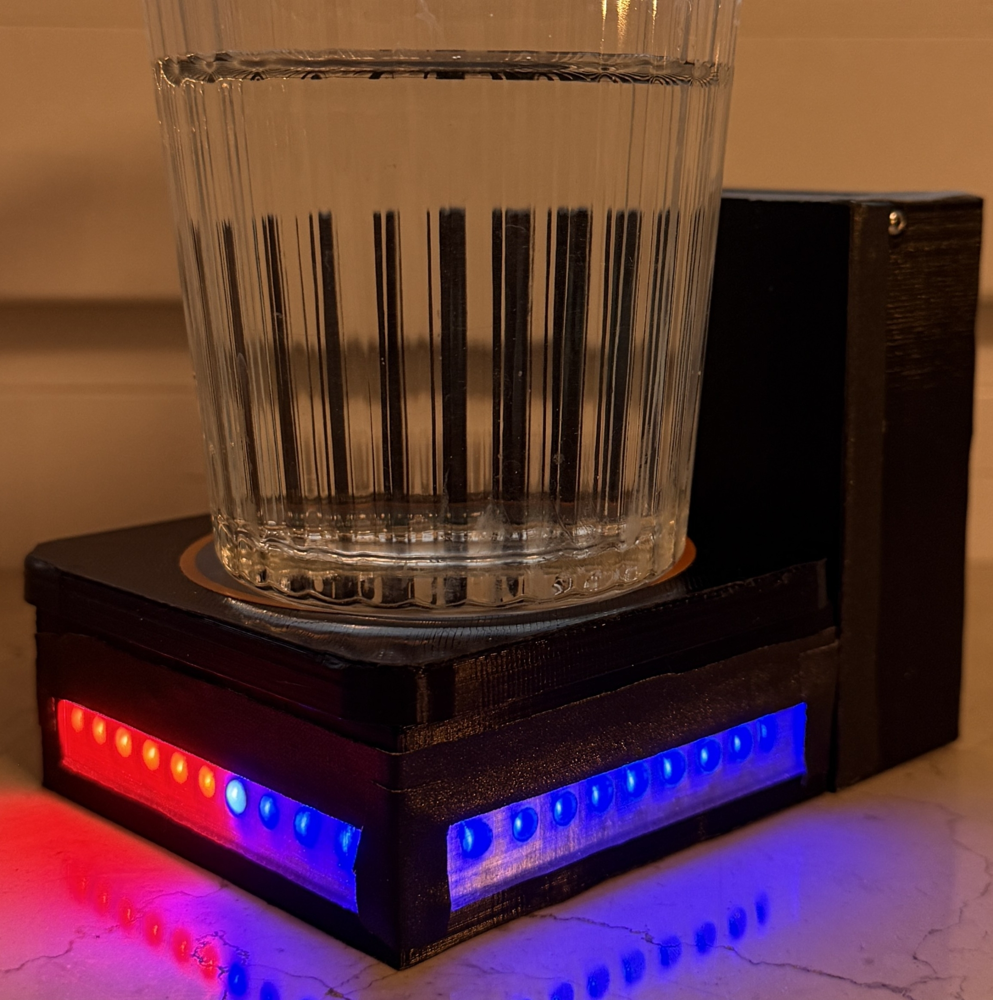
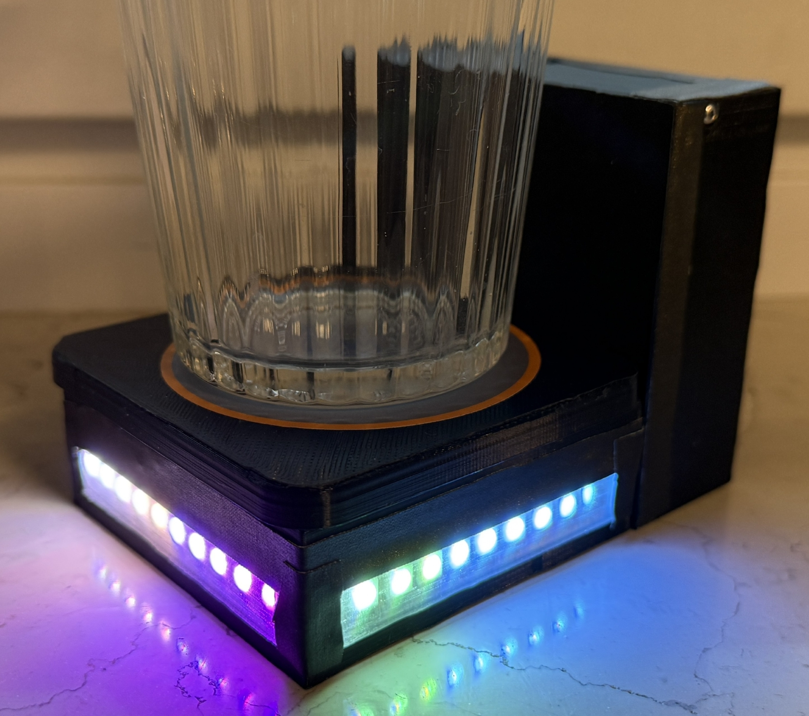
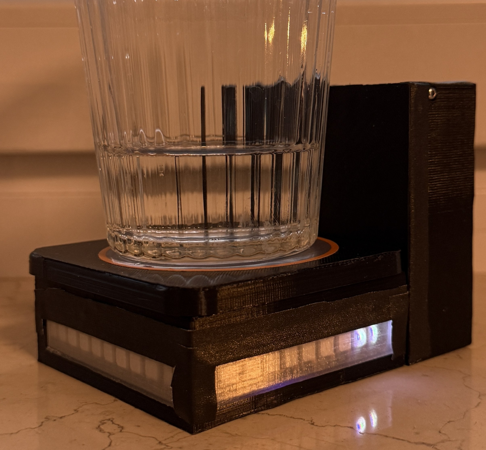

# Smart Coaster – 📟 Arduino Firmware


[](https://github.com/vladyslavm-dev/smart-coaster-firmware/actions/workflows/arduino-ci.yml)

Firmware for a **BLE-enabled smart coaster** based on the **Arduino Nano 33 BLE**.  

It measures cup weight via a load cell + HX711, detects **drinks / refills**, and sends compact BLE events to the Android companion app.

Developed as part of my Bachelor’s thesis in Information Systems at TUM.

<table>
  <tr>
    <td align="center">
      <br/>
      <sub>Intake</sub>
    </td>
    <td align="center">
      <br/>
      <sub>Refill</sub>
    </td>
    <td align="center">
      <br/>
      <sub>Reminder</sub>
    </td>
    <td align="center">
      <br/>
      <sub>Idle</sub>
    </td>
  </tr>
</table>

---

### 🔌 Hardware Overview
- **MCU:** Arduino Nano 33 BLE
- **Sensor:** HX711 + load cell (mounted under coaster)
- **LEDs:** Adafruit NeoPixel ring (23 pixels)
- **Connectivity:** Bluetooth Low Energy (GATT)
- **Power:** USB or 3.3V supply (depending on your setup)

The firmware:
- Tares an **empty cup** once at startup.
- Tracks changes in weight to distinguish:
  - **Intake** (patient drinks)  
  - **Refill** (staff refills the cup)
- Uses the NeoPixel ring for **immediate feedback**:
  - Green wave → drink
  - Blue wave → refill
  - Red → cup removed / error
  - Multi-color flash → reminder from Android app

---
### 📡 BLE Service & Protocol
BLE UUIDs match the Android app (`BleUuids`):
- **Service UUID:** `6d12c00c-d907-4af8-b4d5-42680cdbbe04`
- **TX Characteristic (Notify → Android):** `c663891c-6163-43cc-9ad6-0771785fde9d`
- **RX Characteristic (Write → Coaster):** `ab36ebe1-b1a5-4c46-b4e6-d54f3fb53247`

#### Payload Format
**Scale → Android** (TX characteristic, ASCII):
```text
I 45.23 a     # Intake of 45.23 g from cup "a"
R 32.10 a     # Refill of 32.10 g for cup "a"
```
- `I` → intake (patient drank)
- `R` → refill
- `amount` → grams of water
- `cup` → cup identifier (single char, e.g. a)

**Android → Scale** (RX characteristic, 1 byte):
- `0x01` → trigger reminder animation (`flashMultiColor5Times()`)

The Android app turns these messages into `WaterEvent` objects and stores them in `DataManager`.

---
### ⚙️ Weight Logic & Thresholds
HX711 is configured with calibration values from the lab:
```cpp
float storedOffset      = 71306.00;
float storedScaleFactor = -1095.25;
```
**Key thresholds:**
- `MIN_CUP_WEIGHT = 200 g` – Rejects unrealistically light cups during tare.
- `DRINK_SENSITIVITY = 15 g` – Drop larger than this → treat as a drink.
- `REFILL_SENSITIVITY = 30 g` – Increase larger than this → treat as a refill.
- `CUP_REMOVED_MARGIN = 30 g` – If weight falls below (tare - margin) → cup removed.
  
The firmware waits for stable readings using `waitForStableReadingRaw()` (multiple HX711 samples, small deltas between them) to avoid noise.

---
### 💡 LED Behavior
- **Boot:** blue ring while the system comes up.
- **Tare successful:** small white segment (idle).
- **Cup removed:** full red ring.
- **Drink detected:** green wave animation.
- **Refill detected:** blue wave animation.
- **Reminder from Android:** multi-color flashing sequence, then back to idle white segment.
  
All animations call `BLE.poll()` inside loops to keep the BLE link responsive while LEDs are updating.

---
### 💻 Building & Uploading
#### Arduino IDE
1. Open `smart-coaster-firmware.ino` in Arduino IDE.
2. Select board:
   - **Tools → Board → Arduino Mbed OS → Arduino Nano 33 BLE.**
3. Select the correct port.
4. Click **Verify** (✓).
5. Click **Upload** (→).
#### Arduino CLI (Optional)
If you want to script builds:
```bash
arduino-cli core update-index
arduino-cli core install arduino:mbed_nano
arduino-cli compile \
  --fqbn arduino:mbed_nano:nano33ble \
  smart-coaster-firmware.ino
arduino-cli upload \
  -p /dev/ttyACM0 \
  --fqbn arduino:mbed_nano:nano33ble \
  smart-coaster-firmware.ino
```
Adjust port as needed.

---
### 📲 Android Companion App
The firmware is designed to work with the Android app:
➡️ **[Smart Coaster – Clinical Fluid Intake Monitor (Android)](https://github.com/vladyslavm-dev/smart-coaster-android)**

The Android app:
- Maintains three parallel BLE connections.
- Parses messages like `"I 45.23 a"`.
- Aggregates intake per patient (1h / 1d / 1w / 1m).
- Exports events as CSV.
---
## 📦 Third-Party Libraries
This firmware uses the following Arduino libraries:
- **HX711** – ADC driver for the load cell amplifier (reading cup weight in grams).
- **Adafruit NeoPixel** – controls the RGB LED ring animations for intake, refill, reminder, and error states.
- **ArduinoBLE** – provides the Bluetooth Low Energy GATT server, custom service and characteristics for communication with the Android app.
  
All logic around weight stabilization, event detection (intake/refill/cup removed), BLE buffering, and LED animation patterns is implemented manually.

---
## 📜 Possible Extensions
Some ideas that would be natural next steps:
- Add calibration mode accessible via BLE command.
- Support multiple cup profiles with different tare values.
---
## 📝 License
- MIT License
- Copyright (c) 2025 Vladyslav Marchenko
---
## 👤 Author
**Vladyslav Marchenko**
- GitHub: [@vladyslavm-dev](https://github.com/vladyslavm-dev)
- Website: [vladyslavm.dev](https://vladyslavm.dev)
---


