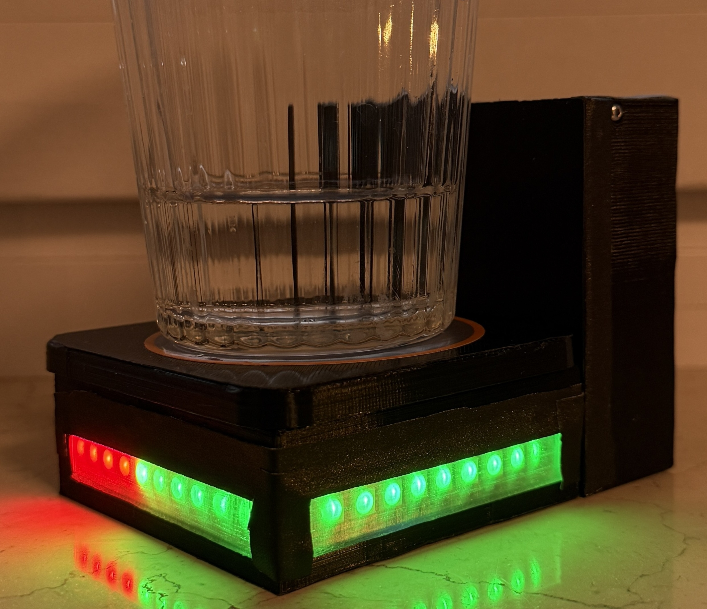
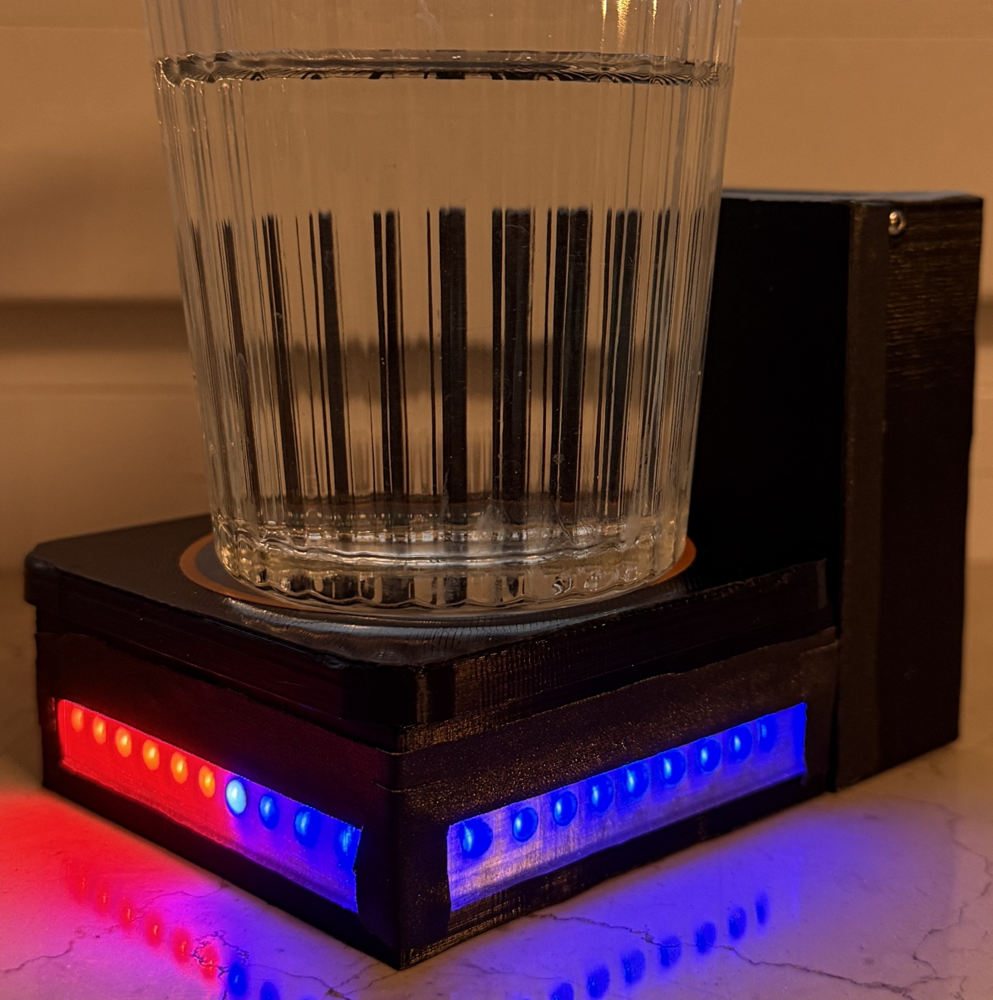
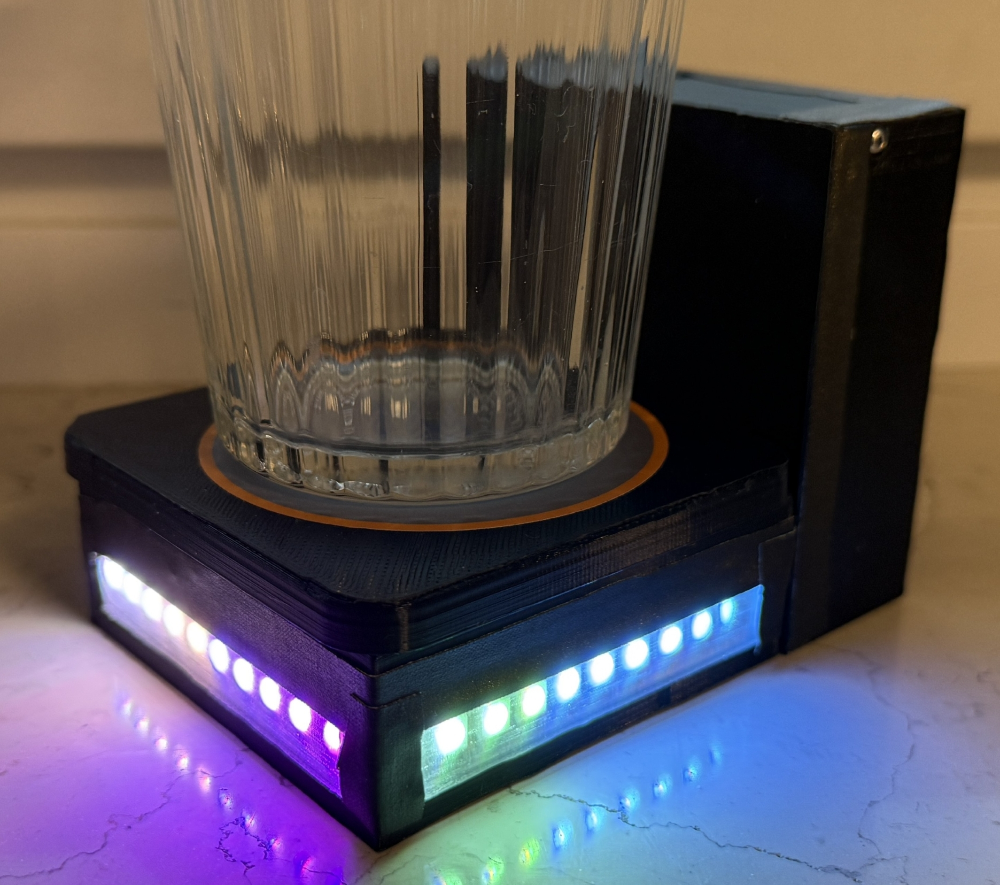
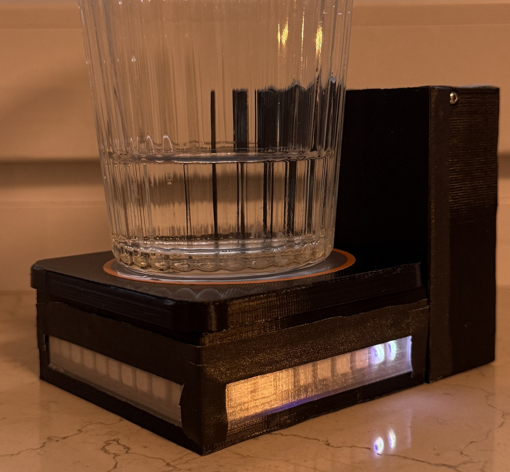

# Smart Coaster – Arduino Firmware


[](https://github.com/vladyslavm-dev/smart-coaster-firmware/actions/workflows/arduino-ci.yml)

Firmware for a **BLE-enabled smart coaster** based on the **Arduino Nano 33 BLE**.

It measures cup weight via a load cell + HX711, detects **drinks and refills**, and sends compact BLE events to the Android companion app. The NeoPixel ring provides immediate visual feedback so patients know the system is working without looking at a screen.

Scales were tested by 8 patients within a clinical pilot.

Developed as part of my Bachelor's thesis in Information Systems at TUM. 

<table>
  <tr>
    <td align="center">
      <br/>
      <sub>Intake detected</sub>
    </td>
    <td align="center">
      <br/>
      <sub>Refill detected</sub>
    </td>
    <td align="center">
      <br/>
      <sub>Drink reminder</sub>
    </td>
    <td align="center">
      <br/>
      <sub>Idle state</sub>
    </td>
  </tr>
</table>

---

## Hardware

| Component | Part |
|-----------|------|
| MCU | Arduino Nano 33 BLE |
| Sensor | HX711 load cell amplifier + load cell (mounted under coaster) |
| LEDs | Adafruit NeoPixel ring (23 pixels) |
| Connectivity | Bluetooth Low Energy (GATT server) |
| Power | USB or 3.3V supply |

---

## Features

### Weight-Based Event Detection

The firmware tares an empty cup at startup, then continuously monitors weight changes to classify events:

- **Intake** — weight drops by more than 15g (patient drank).
- **Refill** — weight increases by more than 30g (staff refilled the cup).
- **Cup removed** — weight falls below tare minus 30g margin.

All readings pass through `waitForStableReadingRaw()` which takes multiple HX711 samples and checks for small deltas between them, filtering out sensor noise and transient vibrations.

### LED Feedback

The NeoPixel ring gives patients and staff immediate visual confirmation without needing to check the app:

| State | Animation |
|-------|-----------|
| Boot | Blue ring while system initializes |
| Tare successful | Small white segment (idle) |
| Drink detected | Green wave animation |
| Refill detected | Blue wave animation |
| Cup removed | Full red ring |
| Reminder from app | Multi-color flash sequence, returns to idle |

All LED animations call `BLE.poll()` inside their loops to keep the Bluetooth link responsive while pixels are updating.

### BLE GATT Service

The firmware exposes a custom BLE service with two characteristics — one for sending events to the Android app (notify), one for receiving commands (write). The Android app maintains up to three parallel connections, one per coaster.

---

## BLE Protocol

### UUIDs

| UUID | Role |
|------|------|
| `6d12c00c-d907-4af8-b4d5-42680cdbbe04` | Service |
| `c663891c-6163-43cc-9ad6-0771785fde9d` | TX Characteristic (notify to Android) |
| `ab36ebe1-b1a5-4c46-b4e6-d54f3fb53247` | RX Characteristic (write from Android) |

### Data Format

**Scale to Android** (TX characteristic, ASCII):

```text
I 45.23 a     # Intake of 45.23 g from cup "a"
R 32.10 a     # Refill of 32.10 g for cup "a"
```

- `I` = intake (patient drank), `R` = refill (staff topped up)
- `amount` = grams of water
- `cup` = cup identifier (single char)

**Android to Scale** (RX characteristic, 1 byte):

- `0x01` — triggers `flashMultiColor5Times()` reminder animation.

---

## Weight Logic and Thresholds

Calibration values from lab measurements:

```cpp
float storedOffset      = 71306.00;
float storedScaleFactor = -1095.25;
```

| Threshold | Value | Purpose |
|-----------|-------|---------|
| `MIN_CUP_WEIGHT` | 200g | Rejects unrealistically light cups during tare |
| `DRINK_SENSITIVITY` | 15g | Weight drop larger than this triggers intake event |
| `REFILL_SENSITIVITY` | 30g | Weight increase larger than this triggers refill event |
| `CUP_REMOVED_MARGIN` | 30g | Weight below (tare - margin) triggers cup-removed state |

---

## Getting Started

### Arduino IDE

1. Open `smart-coaster-firmware.ino` in Arduino IDE.
2. Select board: **Tools > Board > Arduino Mbed OS > Arduino Nano 33 BLE.**
3. Select the correct port.
4. Click **Verify** then **Upload**.

### Arduino CLI

```bash
arduino-cli core update-index
arduino-cli core install arduino:mbed_nano
arduino-cli compile \
  --fqbn arduino:mbed_nano:nano33ble \
  smart-coaster-firmware.ino
arduino-cli upload \
  -p /dev/ttyACM0 \
  --fqbn arduino:mbed_nano:nano33ble \
  smart-coaster-firmware.ino
```

Adjust the port as needed for your system.

---

## Third-Party Libraries

| Library | Purpose |
|---------|---------|
| **HX711** | ADC driver for the load cell amplifier |
| **Adafruit NeoPixel** | RGB LED ring control for status animations |
| **ArduinoBLE** | BLE GATT server with custom service and characteristics |

All weight stabilization logic, event classification (intake/refill/cup removed), BLE payload formatting, and LED animation patterns are implemented manually.

---

## Companion App

This firmware is designed to work with the Android companion app:

[github.com/vladyslavm-dev/smart-coaster-android](https://github.com/vladyslavm-dev/smart-coaster-android)

The Android app maintains three parallel BLE connections, parses the event messages, aggregates intake per patient with time-windowed summaries, and exports data as CSV.

---

## Possible Extensions

- Add BLE-accessible calibration mode (eliminate hardcoded offset/scale factor).
- Support multiple cup profiles with different tare values.
- Add battery level reporting via BLE for wireless deployments.

---

## License

MIT License — Copyright (c) 2025 Vladyslav Marchenko

See [LICENSE](LICENSE) for details.

---

## Author

**Vladyslav Marchenko**

- GitHub: [@vladyslavm-dev](https://github.com/vladyslavm-dev)
- Website: [vladyslavm.dev](https://vladyslavm.dev)
